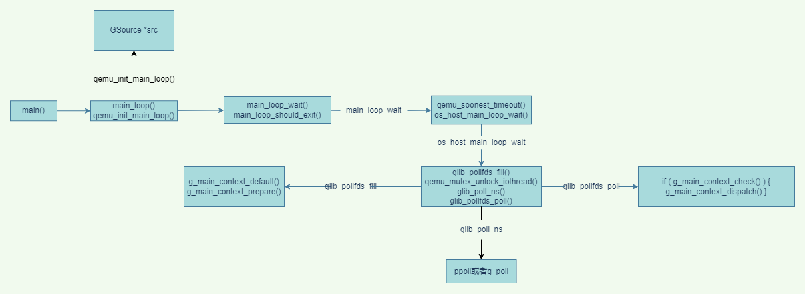
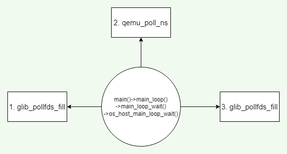
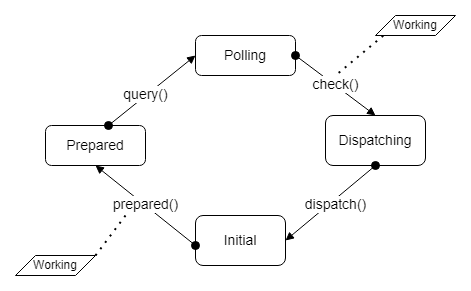

# qemu-study
记录自己分析qemu代码的过程，只做学习使用

# qemu代码分析第一部分：事件循环机制

#### 概述

在linux 系统中，一切皆文件的思想 → qemu在运行的过程中，会将自己感兴趣的文件fd添加到其监听列表上，并定义相应的处理函数。

qemu涉及到事件循环分发机制是基于glib库

#### glib事件循环分发机制

在glib中，使用`GMainLoop`结构体来表示一个事件循环z

在其主线程中，有一个循环用于处理这些fd事件，比如用户的输入，来自网络的链接等等

相关的主要数据结构：

Gsource 结构体，主要保存的是pollfd[^注释1]（要监听文件描述符），表示mainloop感兴趣的结构体

```c
struct _GSource
{
  /*< private >*/
  gpointer callback_data;
  GSourceCallbackFuncs *callback_funcs;
  // 事件源回调函数
  const GSourceFuncs *source_funcs;
  // 引用计数
  guint ref_count;
  // 主事件上下文
  GMainContext *context;
  // 优先级
  gint priority;
  // 状态
  guint flags;
  // 事件源ID
  guint source_id;

  GSList *poll_fds;
  // 双向链表的结构
  GSource *prev;
  GSource *next;
  // 名字
  char    *name;
  // 私有数据
  GSourcePrivate *priv;
};

```

在注册完main\_loop感兴趣的GSource文件双向链表之后，需要实现事件源所规定接口。

Glib对一个事件源的处理分为四个阶段：初始化，准备,poll和调度，每个阶段都提供了接口供用户注册处理函数。

```c
gboolean (*prepare)  (GSource    *source,
                        gint       *timeout_);
gboolean (*check)    (GSource    *source);
gboolean (*dispatch) (GSource    *source,
                        GSourceFunc callback,
                        gpointer    user_data);
                        
// 封装在一个结构体中，GSourceFuncs
struct _GSourceFuncs
{
  gboolean (*prepare)  (GSource    *source,
                        gint       *timeout_);
  gboolean (*check)    (GSource    *source);
  gboolean (*dispatch) (GSource    *source,
                        GSourceFunc callback,
                        gpointer    user_data);
  void     (*finalize) (GSource    *source); /* Can be NULL */

  /*< private >*/
  /* For use by g_source_set_closure */
  GSourceFunc     closure_callback;        
  GSourceDummyMarshal closure_marshal; /* Really is of type GClosureMarshal */
};

```

函数的解析：（还包含query,dispatch，从事件的准备到最后响应分达到具体的对应事件的处理函数）

*   prepare：初始化完成之后执行poll之前调用，做一些准备工作，事件源有事件发生就返回TRUE，除此之外还会返回timeout表示poll调用的超时时间，通过`g_main_context_prepare()`函数遍历`GMainContext`拥用的事件源，然后调用事件源中的`_GSourceFuncs→prepare()`计算下一次轮询间隔。

    当Glib初始化完成之后会调用此接口，此接口返回`TRUE`表示事件源已经的准备好，跳过poll直接判断是否执行对应的回调函数，返回`FALSE`表示需要`poll`机制监听事件源是否准备好，如果事件源没有准备好，通过参数`timeout`指定`poll`最长的阻塞时间，超时后直接返回，超时的处理可以防止一个fd或其他事件源阻塞整个应用。

*   query：propare完成之后，获得实际需要调用poll的文件

*   check：poll返回后调用此接口，用户通过注册此接口判断那些事件源需要被处理，此接口返回`TRUE`表示对应事件源的回调函数需要被执行，返回`FALSE`表示回调函数不需要被执行。

*   dispatch：根据check调用返回的结果调用此接口。`gboolean (*dispatch) (GSource *source, GSourceFunc callback, gpointer user_data);`其中参数`callback`和`user_data`是用户通过`g_source_set_callback`注册的事件源回调和对应的参数，用户可以在dispatch中选择直接执行`callback`，也可以不执行。

## main函数主循环调用流程分析



上面这张图是根据qemu2.8.1源码分析得到

1.  qemu中事件循环机制是利用的Glib的事件循环机制。首先在main函数中调用`main_loop`真正执行主循环函数。

    ```c
    // vl.c

    int main(int argc, char **argv, char **envp)
    {
    //... 初始化等其他工作
        // 真正执行主循环的函数main_loop
        main_loop();
    //...
    }
    ```

2.  在main\_loop()函数中循环调用`main_loop_wait`函数实现对fd的事件的持续监听和分发

    ```c
    // main-loop.c

    static void main_loop(void)
    {
        // ...
        do {
          //...
          
          // 循环执行main_loop_wait函数
          lat_io = main_loop_wait(nonblocking);
          
          //...
          }while(!main_loop_should_wxit())
    }
    ```

3.  在`main_loop_wait`函数中调用`qume_soonest_timeout`和`os_host_main_loop_wait`函数，`qume_soonest_timeout`函数计算最小的`time_out`值并返回给timeout\_ns变量，该变量作为`os_host_main_loop_wait`函数额参数，可以使QEMU即使处理定时器到期的事件.

    即无论是fd ready 还是timer timeout 都会导致poll的返回进行事件的处理

    `os_host_main_loop_wait`三个有关循环的函数`glib_pollfds_fill`, `qemu_poll_ns`, `glib_pollfds_fill`。即QEMU循环是针对这三个函数进行的循环调用。依次是

    `glib_pollfds_fill`    →    `qemu_poll_ns`   →    `glib_pollfds_fill`

    

    主循环的核心函数就是这三个，其实就是对于glib库函数的qemu封装。glib事件循环状态转化图如下面所示：

    

    函数的详细内容在上面有所介绍。

    ```c
    int main_loop_wait(int nonblocking)
    {
        int ret;
        // ...
        // 计算最小的timeout值，作为os_host_main_loop_wait函数的参数
        // 获取最小timeout时间的目的是，poll循环可以及时处理过期事件。
        // poll返回两种情况，定时事件到期，或者fd有相应
        timeout_ns = qemu_soonest_timeout(timeout_ns,
                                          timerlistgroup_dealine_ns(
                                              &main_loop_tlg));
        // 三个核心函数
        ret = os_host_main_loop_wait(timeout_ns);
         
        //...
        return ret;
     }

    ```

4.  `qemu_soonest_timeout`函数计算出最小的timeout事件返回给`timeout_ns`作为主循环相关的参数`os_host_main_loop_wait`。

    ```c
    // 对事件进行监听
    // 三步：glib_pollfds_fill    qemu_poll_ns    glib_pollfds_fill
    static int os_host_main_loop_wait(int64_t timeout)
    {
        int ret;
        static int spin_counter;
        // 第一步：准备工作。获取实际需要调用poll的fd

        // g_main_context_prepare  g_main_context_query
        glib_pollfds_fill(&timeout);
        
        // ...
        
        // 第二步：
        // 会阻塞主线程，要么返回发生了事件，要么返回一个超时
        ret = qemu_poll_ns((GPollFD *)gpollfds->data, gpollfds->len, timeout);
        
        //...
        
        // 第三步：进行事件的检查和分发处理
        glib_pollfds_poll();
        return ret;
    }
    ```

    1.  `glib_pollfds_fill`函数实际上调用了glib中的`g_main_context_prepare`和`g_main_context_query`，prepare的作用是为主循环的监听做准备，

        &#x20;   // 返回TRUE，表示事件源已经准备好，跳过poll的监听
        &#x20;   // 返回FALSE，表示事件源还没有准备好，需要进行poll的监听，然后设置超时时间

        ```c
        // 获取所有需要进行监听的fd，并且计算一个最小的超时时间
        // 执行了Glib库中的两个接口，为监听做准备并获取需要poll监听的fd
        // g_main_context_prepare  g_main_context_query
        static void glib_pollfds_fill(int64_t *cur_timeout)
        {
            // GMainContext是Gsource的容器，Gsource可以添加到GMainContext里面
            // Gsource结构体保存了pollfd，包含文件fd和
            GMainContext *context = g_main_context_default();
            int timeout = 0;
            int64_t timeout_ns;
            int n;
            // 为主循环的监听做准备
            // 通过该函数会调用相应的prepare回调函数 时间准备好监听以后会返回true
            // prepare主要做三件事
            // 1. 查看是否有准备就绪的事件源，如果有返回true 如果没有返回false
            // 2. 找到最高优先级的准备就绪的事件源，把该优先级赋值给传出参数max_priority
            // 3. 设置GmainContext.timeout值，表示最近一次要到超时的事件源的时间
            // 当函数返回TRUE表示事件源已经准备好不需要poll的监听，进入下一步是否对事件源进行处理
            // 当函数返回FALSE表示事件源没有准备好，需要poll进行监听等待事件源的相应，并设置一个超时时间
            g_main_context_prepare(context, &max_priority);

            glib_pollfds_idx = gpollfds->len;
            n = glib_n_poll_fds;
            // 进入循环 在循环中调用query
            do { 
                GPollFD *pfds;
                glib_n_poll_fds = n;
                // 参数gpollfds 是一个全局变量保存了需要监听的fd
                g_array_set_size(gpollfds, glib_pollfds_idx + glib_n_poll_fds);
                pfds = &g_array_index(gpollfds, GPollFD, glib_pollfds_idx);
                // 获取实际需要调用的poll 的文件fd
                // 循环获取
                n = g_main_context_query(context, max_priority, &timeout, pfds,
                                         glib_n_poll_fds);
            } while (n != glib_n_poll_fds);

            if (timeout < 0) {
                timeout_ns = -1;
            } else {
                timeout_ns = (int64_t)timeout * (int64_t)SCALE_MS;
            }

            *cur_timeout = qemu_soonest_timeout(timeout_ns, *cur_timeout);
        }
        ```

    2.  第一步进行完成之后获取到实际需要调用pollfd，存放在全局变量`gpollfds中`，之后执行`qemu_poll_ns`，这一步会阻塞主进程，等待返回一个事件发生或者一个超时时间。就是执行poll的操作（IO多路复用）。

        ```c
        // 实际上就是poll的实现
        // g_poll的qemu实现，除了使用了纳秒级别的超时，其他和g_poll相同
        int qemu_poll_ns(GPollFD *fds, guint nfds, int64_t timeout)
        {
        // 如果QEMU配置了PPOLL，则使用PPOLL实现POLL对fd的监听，否则使用g_poll实现poll对fd监听
        #ifdef CONFIG_PPOLL
            // 如果超时时间小于0，如果IO没有准备好，永远阻塞
            if (timeout < 0) {
                // 否则阻塞一段时间后返回
                return ppoll((struct pollfd *)fds, nfds, NULL, NULL);
            } else {
                struct timespec ts;
                int64_t tvsec = timeout / 1000000000LL;
                /* Avoid possibly overflowing and specifying a negative number of
                 * seconds, which would turn a very long timeout into a busy-wait.
                 */
                if (tvsec > (int64_t)INT32_MAX) {
                    tvsec = INT32_MAX;
                }
                ts.tv_sec = tvsec;
                ts.tv_nsec = timeout % 1000000000LL;
                return ppoll((struct pollfd *)fds, nfds, &ts, NULL);
            }
        #else
            return g_poll(fds, nfds, qemu_timeout_ns_to_ms(timeout));
        #endif
        }

        ```

    3.  执行完`qemu_poll_ns`后，经过poll的监听，要么返回超时事件，要么返回准备好事件，下一步是调用`glib_pollfds_poll` 执行事件的分发。

        ```c
        // 调用 g_main_context_check g_main_context_dispatch
        // 实现事件的是否相应，并将相应的事件进行分发
        static void glib_pollfds_poll(void)
        {
            GMainContext *context = g_main_context_default();
            GPollFD *pfds = &g_array_index(gpollfds, GPollFD, glib_pollfds_idx);
            // 执行完poll之后调用check对事件进行检查，如果事件相应了的就返回的TRUE
            if (g_main_context_check(context, max_priority, pfds, glib_n_poll_fds)) {
                // 事件相应则调用dispatch将事件进行分发（执行callback）
                g_main_context_dispatch(context);
            }
        }

        ```

[^注释1]: struct pollfd {
    &#x20;       // 文件描述符
    &#x20;       int fd;
    &#x20;       // 等待的事件
    &#x20;       short events;
    &#x20;       // 实际发生的事件
    &#x20;       short revents;
    }


# QEMU线程模型

现在比较流行的两种架构

1.  并行架构：把那些可以同时执行的工作分成多个进程或是线程

2.  事件驱动架构：通过执行一个主循环来发送事件到handler以此对事件做出反馈处理，通常使用select或者poll系统调用等待多重描述符的方式实现。

QEMU架构：

*   使用上面两种架构的混合架构，使用事件驱动编程和线程相结合

*   为什么：单纯的事件循环的不能利用多个CPU内核，因为只有一个执行线程。

*   参考

    <http://blog.vmsplice.net/2011/03/qemu-internals-overall-architecture-and.html>

整个QEMU线程同步通常使用QEMU大锁。

*   获取锁的函数是：`qemu_mutex_lock_iothread`

*   释放锁的函数是：`qemu_mutex_unlock_iothread`

具体例子，在QEMU主循环中获取锁的过程。

```c
static int os_host_main_loop_wait(int64_t timeout)
{
    int ret;
    static int spin_counter;
    
    glib_pollfds_fill(&timeout);
    // ......

    if (timeout) {
        spin_counter = 0;
        // 释放锁
        qemu_mutex_unlock_iothread();
    } else {
        spin_counter++;
    }

    ret = qemu_poll_ns((GPollFD *)gpollfds->data, gpollfds->len, timeout);

    if (timeout) {
    // 获得锁
        qemu_mutex_lock_iothread();
    }

    glib_pollfds_poll();
    return ret;
}
```

进一步查看两个函数的实现，可以在`cpus.c`函数中找到具体实现

```c
void qemu_mutex_lock_iothread(void)
{
    // 参数的类型是static unsigned 无符号整形
    // 原子+1
    atomic_inc(&iothread_requesting_mutex);
    /* In the simple case there is no need to bump the VCPU thread out of
     * TCG code execution.
     */
    if (!tcg_enabled() || qemu_in_vcpu_thread() ||
        !first_cpu || !first_cpu->created) {
        // 获得大锁 如果锁被占据，则阻塞当前线程
        qemu_mutex_lock(&qemu_global_mutex);
        // 原子-1
        atomic_dec(&iothread_requesting_mutex);
    } else {
        // 不会阻塞当前线程，立即返回一个锁的状态 qemu_mutex_trylock
        if (qemu_mutex_trylock(&qemu_global_mutex)) {
            qemu_cpu_kick_no_halt();
            // 获得锁
            qemu_mutex_lock(&qemu_global_mutex);
        }
        // 原子-1
        atomic_dec(&iothread_requesting_mutex);
        qemu_cond_broadcast(&qemu_io_proceeded_cond);
    }
    iothread_locked = true;
}
```

上面涉及到很多知识盲区，atomic\_inc这个函数是一个原子操作，相关知识点总结在[原子操作](https://www.wolai.com/wiMhiY6TNq5r86pePnzdR.md "原子操作")

有关QEMU锁的操作，有下面这些：

```c
// 初始化锁
int pthread_mutex_init(pthread_mutex_t *restrict mutex,const pthread_mutexattr_t *restrict attr);  
// 销毁锁
int pthread_mutex_destory(pthread_mutex_t *mutex );  
// 加锁 如果锁被占用，则阻塞当前线程
int pthread_mutex_lock(pthread_mutex_t *mutex);  
// 加锁 不会阻塞当前线程，立即返回一个锁的状态
int pthread_mutex_trylock(pthread_mutex_t *mutex); 
// 解锁 
int pthread_mutex_unlock(pthread_mutex_t *mutex);  
```

底层其实是对pthread库的封装

*   qemu\_mutex\_init –> pthread\_mutex\_init

*   qemu\_mutex\_destroy –> pthread\_mutex\_destroy

*   qemu\_mutex\_lock –> pthread\_mutex\_lock（如果锁被占据，则阻塞当前线程）

*   qemu\_mutex\_trylock –> pthread\_mutex\_trylock（不会阻塞当前线程，会立即返回一个锁的状态值）

*   qemu\_mutex\_unlock –> pthread\_mutex\_unlock

